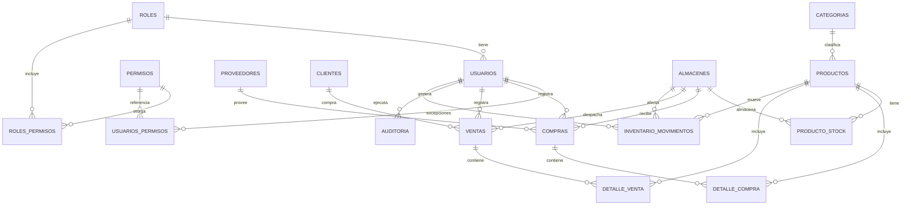

# Modelo Entidad-Relación — AtlasERP

## 1. Resumen

Este documento define el modelo de datos de AtlasERP: 17 tablas, sus columnas, tipos, restricciones y relaciones. Es la base sobre la que se generarán las entidades JPA, repositorios, servicios y controladores del backend.

**Decisiones de diseño clave:**

- **Multi-almacén**: el stock no es un atributo fijo de `productos`; vive en `producto_stock`, una tabla puente por producto y almacén.
- **RBAC granular**: los permisos se asignan por rol (`roles_permisos`) y admiten excepciones puntuales por usuario (`usuarios_permisos`), con semántica GRANT/DENY.
- **Trazabilidad histórica**: `detalle_compra` y `detalle_venta` guardan su propio `precio_unitario`, independiente del precio vigente en `productos`.
- **Soft delete**: los catálogos (`clientes`, `proveedores`, `productos`, `categorias`, `almacenes`, `roles`) usan columna `activo` en vez de `DELETE` físico.
- **Auditoría genérica**: una sola tabla `auditoria` cubre todas las entidades vía `entidad` + `entidad_id`, en vez de una tabla de log por módulo.

## 2. Diagrama ER

> Este bloque `mermaid` se renderiza automáticamente en GitHub. Al final del documento hay una versión ampliada con todas las columnas visibles.

## 3. Definición de tablas

### 3.1 `roles`
| Columna | Tipo | Restricciones |
|---|---|---|
| id | BIGSERIAL | PK |
| nombre | VARCHAR(50) | UNIQUE, NOT NULL |
| descripcion | VARCHAR(255) | |
| activo | BOOLEAN | NOT NULL, DEFAULT true |
| created_at | TIMESTAMP | NOT NULL, DEFAULT now() |

### 3.2 `permisos`
| Columna | Tipo | Restricciones |
|---|---|---|
| id | BIGSERIAL | PK |
| codigo | VARCHAR(100) | UNIQUE, NOT NULL — ej. `productos.crear` |
| modulo | VARCHAR(50) | NOT NULL — ej. `productos` |
| accion | VARCHAR(50) | NOT NULL — ej. `crear`, `editar`, `eliminar`, `ver` |
| descripcion | VARCHAR(255) | |

### 3.3 `roles_permisos`
| Columna | Tipo | Restricciones |
|---|---|---|
| rol_id | BIGINT | PK compuesta, FK → roles.id |
| permiso_id | BIGINT | PK compuesta, FK → permisos.id |

### 3.4 `usuarios_permisos` (excepciones)
| Columna | Tipo | Restricciones |
|---|---|---|
| usuario_id | BIGINT | PK compuesta, FK → usuarios.id |
| permiso_id | BIGINT | PK compuesta, FK → permisos.id |
| tipo | VARCHAR(10) | NOT NULL, CHECK IN ('GRANT','DENY') |

**Regla de resolución de permisos efectivos**: `DENY` explícito > permiso otorgado por rol o `GRANT` explícito > sin permiso por defecto.

### 3.5 `usuarios`
| Columna | Tipo | Restricciones |
|---|---|---|
| id | BIGSERIAL | PK |
| rol_id | BIGINT | FK → roles.id, NOT NULL |
| username | VARCHAR(50) | UNIQUE, NOT NULL |
| email | VARCHAR(150) | UNIQUE, NOT NULL |
| password_hash | VARCHAR(255) | NOT NULL (BCrypt) |
| nombre | VARCHAR(100) | NOT NULL |
| apellido | VARCHAR(100) | NOT NULL |
| activo | BOOLEAN | NOT NULL, DEFAULT true |
| created_at | TIMESTAMP | NOT NULL, DEFAULT now() |
| updated_at | TIMESTAMP | |

### 3.6 `clientes`
| Columna | Tipo | Restricciones |
|---|---|---|
| id | BIGSERIAL | PK |
| tipo_documento | VARCHAR(10) | NOT NULL |
| numero_documento | VARCHAR(20) | UNIQUE, NOT NULL |
| nombre | VARCHAR(150) | NOT NULL |
| email | VARCHAR(150) | |
| telefono | VARCHAR(20) | |
| direccion | VARCHAR(255) | |
| activo | BOOLEAN | NOT NULL, DEFAULT true |
| created_at | TIMESTAMP | NOT NULL, DEFAULT now() |

### 3.7 `proveedores`
Misma estructura que `clientes` (tipo_documento, numero_documento, nombre, email, telefono, direccion, activo, created_at).

### 3.8 `categorias`
| Columna | Tipo | Restricciones |
|---|---|---|
| id | BIGSERIAL | PK |
| nombre | VARCHAR(100) | UNIQUE, NOT NULL |
| descripcion | VARCHAR(255) | |
| activo | BOOLEAN | NOT NULL, DEFAULT true |

### 3.9 `almacenes`
| Columna | Tipo | Restricciones |
|---|---|---|
| id | BIGSERIAL | PK |
| nombre | VARCHAR(100) | UNIQUE, NOT NULL |
| direccion | VARCHAR(255) | |
| activo | BOOLEAN | NOT NULL, DEFAULT true |

### 3.10 `productos`
| Columna | Tipo | Restricciones |
|---|---|---|
| id | BIGSERIAL | PK |
| categoria_id | BIGINT | FK → categorias.id |
| codigo | VARCHAR(50) | UNIQUE, NOT NULL |
| nombre | VARCHAR(150) | NOT NULL |
| descripcion | TEXT | |
| precio_compra | NUMERIC(12,2) | NOT NULL, CHECK >= 0 |
| precio_venta | NUMERIC(12,2) | NOT NULL, CHECK >= 0 |
| stock_minimo | INT | NOT NULL, DEFAULT 0 |
| imagen_url | VARCHAR(255) | |
| activo | BOOLEAN | NOT NULL, DEFAULT true |
| created_at | TIMESTAMP | NOT NULL, DEFAULT now() |
| updated_at | TIMESTAMP | |

### 3.11 `producto_stock`
| Columna | Tipo | Restricciones |
|---|---|---|
| producto_id | BIGINT | PK compuesta, FK → productos.id |
| almacen_id | BIGINT | PK compuesta, FK → almacenes.id |
| cantidad | INT | NOT NULL, DEFAULT 0, CHECK >= 0 |

### 3.12 `inventario_movimientos`
| Columna | Tipo | Restricciones |
|---|---|---|
| id | BIGSERIAL | PK |
| producto_id | BIGINT | FK → productos.id, NOT NULL |
| almacen_id | BIGINT | FK → almacenes.id, NOT NULL (origen) |
| almacen_destino_id | BIGINT | FK → almacenes.id, NULL (solo en TRANSFERENCIA) |
| usuario_id | BIGINT | FK → usuarios.id, NOT NULL |
| tipo | VARCHAR(15) | NOT NULL, CHECK IN ('ENTRADA','SALIDA','TRANSFERENCIA','AJUSTE') |
| cantidad | INT | NOT NULL, CHECK > 0 |
| motivo | VARCHAR(255) | |
| referencia_tipo | VARCHAR(20) | ej. 'COMPRA', 'VENTA', NULL si es manual |
| referencia_id | BIGINT | id de la compra/venta que originó el movimiento |
| fecha | TIMESTAMP | NOT NULL, DEFAULT now() |

### 3.13 `compras`
| Columna | Tipo | Restricciones |
|---|---|---|
| id | BIGSERIAL | PK |
| proveedor_id | BIGINT | FK → proveedores.id, NOT NULL |
| almacen_id | BIGINT | FK → almacenes.id, NOT NULL |
| usuario_id | BIGINT | FK → usuarios.id, NOT NULL |
| numero_factura | VARCHAR(50) | NOT NULL |
| subtotal | NUMERIC(12,2) | NOT NULL |
| impuesto | NUMERIC(12,2) | NOT NULL, DEFAULT 0 |
| total | NUMERIC(12,2) | NOT NULL |
| estado | VARCHAR(15) | NOT NULL, CHECK IN ('PENDIENTE','COMPLETADA','ANULADA') |
| fecha | TIMESTAMP | NOT NULL, DEFAULT now() |

### 3.14 `detalle_compra`
| Columna | Tipo | Restricciones |
|---|---|---|
| id | BIGSERIAL | PK |
| compra_id | BIGINT | FK → compras.id, NOT NULL |
| producto_id | BIGINT | FK → productos.id, NOT NULL |
| cantidad | INT | NOT NULL, CHECK > 0 |
| precio_unitario | NUMERIC(12,2) | NOT NULL, CHECK >= 0 |
| subtotal | NUMERIC(12,2) | NOT NULL (calculado: cantidad × precio_unitario) |

### 3.15 `ventas`
Misma estructura que `compras`, cambiando `proveedor_id` por `cliente_id` (FK → clientes.id).

### 3.16 `detalle_venta`
Misma estructura que `detalle_compra`, cambiando `compra_id` por `venta_id` (FK → ventas.id).

### 3.17 `auditoria`
| Columna | Tipo | Restricciones |
|---|---|---|
| id | BIGSERIAL | PK |
| usuario_id | BIGINT | FK → usuarios.id, NULL si acción del sistema |
| accion | VARCHAR(50) | NOT NULL — ej. 'LOGIN', 'CREAR', 'EDITAR', 'ELIMINAR' |
| entidad | VARCHAR(50) | NOT NULL — nombre de la tabla afectada |
| entidad_id | BIGINT | id del registro afectado |
| detalle | JSONB | payload con los cambios (antes/después) |
| ip_address | VARCHAR(45) | |
| fecha | TIMESTAMP | NOT NULL, DEFAULT now() |

## 4. Reglas de negocio a nivel de base de datos

1. `producto_stock.cantidad >= 0` — imposible vender stock inexistente, aunque falle la validación de aplicación.
2. `precio_compra >= 0` y `precio_venta >= 0` en `productos`.
3. `inventario_movimientos.cantidad > 0` siempre — el signo lo determina el `tipo`, no el número.
4. Toda transferencia (`tipo = 'TRANSFERENCIA'`) debe tener `almacen_destino_id` distinto de `almacen_id` y no nulo; en el resto de los tipos debe ser NULL. (Se valida con un `CHECK` o trigger en PostgreSQL).
5. `detalle_compra.subtotal` y `detalle_venta.subtotal` no dependen del precio vigente del producto — quedan congelados al momento de la transacción.

## 5. Índices recomendados (además de las PK/FK)

- `usuarios(email)`, `usuarios(username)` — ya cubiertos por UNIQUE, pero se usan en cada login.
- `productos(codigo)` — búsqueda frecuente en POS/formularios.
- `inventario_movimientos(producto_id, almacen_id, fecha)` — consultas de kardex por producto y almacén.
- `ventas(fecha)`, `compras(fecha)` — reportes por rango de fechas.
- `auditoria(entidad, entidad_id)` — consultar el historial de un registro específico.
